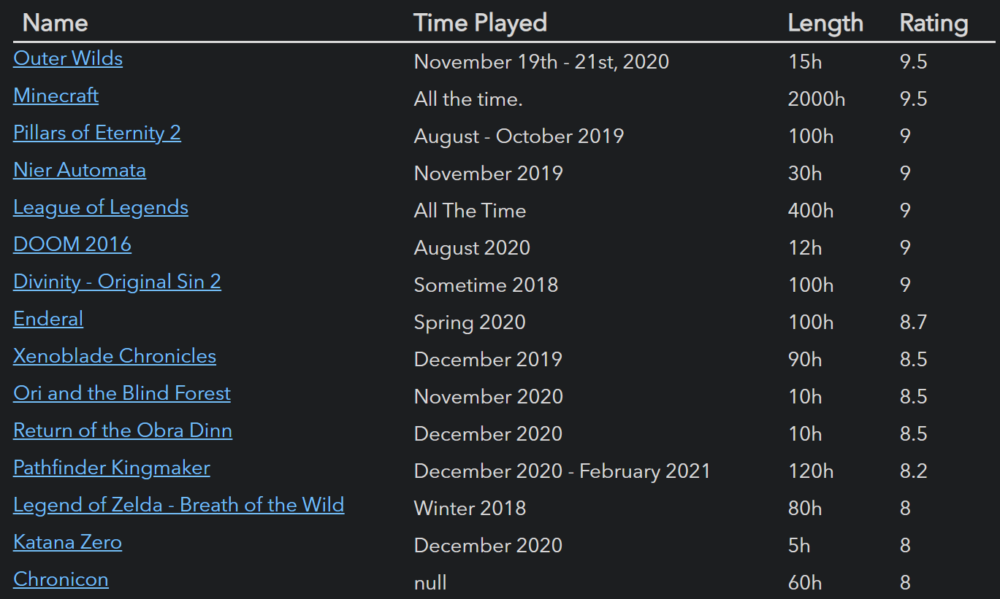
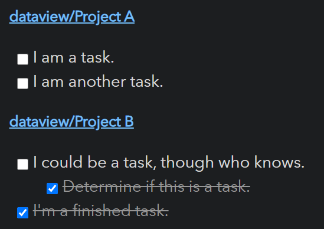

# Obsidian Dataview

Treat your obsidian vault as a database which you can query from. Provides several advanced views for viewing pages, objects, and other data in your vault. You can filter by folders and tags (or combinations of folders & tags) and by YAML front-matter fields; more functionality forthcoming.

## Examples

Show all games in the game folder, sorted by rating, with some metadata:

~~~
```dataview
table time-played, length, rating
from "games"
sort rating desc
```
~~~



---

List games which are MOBAs or CRPGs.

~~~
```dataview
list from #game/moba or #game/crpg
```
~~~


---

List all tasks in un-completed projects:

~~~
```dataview
task from #projects/active
```
~~~



# Usage

Dataview allows you to write queries over markdown files which can be filtered by folder, tag, and markdown YAML fields; it can then display the resulting data in various formats. All dataviews are embedded code blocks with the general form

~~~
```dataview
[list|table|task] field1, (field2 + field3) as myfield, ..., fieldN
from #tag or "folder"
where field [>|>=|<|<=|=|&|'|'] [field2|literal value] (and field2 ...) (or field3...)
sort field [ascending|descending|asc|desc] (ascending is implied if not provided)
```
~~~

The first word in a query is always the view type - currently, either:
- `list`, which just renders a list of files that pass the query filters.
- `table`, which renders files and any selected fields that pass the query filters.
- `task`, which renders all tasks from any files that pass the query filters.

Fields can be any YAML front-matter field (currently, strings and numbers are supported, with support for ratings, links, dates, durations, and intervals forthcoming), any custom defined field (using the `field as field2` syntax) or the special fields `filename` or `filepath`. They can also be functions of other fields - for example, `rating + offset`, is a valid field.

## Roadmap

There is a lot of potential for a generic query system; here is the upcoming features (roughly sorted in order in which I'll work on them):

- [ ] **Query/frontmatter date and duration support**
    - [ ] Expose folder creation time and last modified time as date fields `ctime` and `mtime`.
    - [ ] Expose daily note days as date field `day`.
    - [ ] Add shorthands for various times - `today`, `tommorow`, `eom` (end-of-month), `som` (start-of-month).
- [ ] **Improved query debuggability**:
    - [ ] Show query parse + execute time on views.
    - [ ] Show errors for every file that failed to be selected due to query syntax error.
    - [ ] Improve parsimmon error reporting (possibly rewrite into custom recursive descent parser?)
    - [ ] More parser tests
- [ ] **More complex task queries**:
    - [ ] Filter on a per-task, rather than per-file basis.
    - [ ] Filter tasks by completion.
    - [ ] Include nearby context with tasks - the header they are under, the preceding paragraph, etc.
- [ ] **More query fields**:
    - [ ] Select file title
    - [ ] Select file length (in words, in bytes, etc).
    - [ ] Select from CSV (data is selected from CSV).
- [ ] **Responsive views**:
    - [ ] Allow automatic sorting by clicking on headers.
    - [ ] Allow automatic filtering with a right-click modal.
    - [ ] Add properties to query automatically via a '+' button.
    - [ ] A simple query builder modal? (Something like the vantage plugin for search)
    - [ ] Live Updating View (when a new query match shows up)
- [ ] **Usability**:
    - [ ] Schema validation for objects (using a central `Schema.md` file probably)
- [ ] **More dataviews**:
    - [ ] Calendar view
    - [ ] Timeline view
    - [ ] Gallery view (primarily for images)
    - [ ] Heirarchical view
    - [ ] Object view (create custom objects anywhere in a file & collect them into a list)
